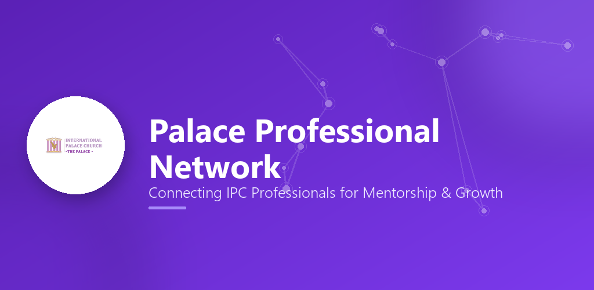
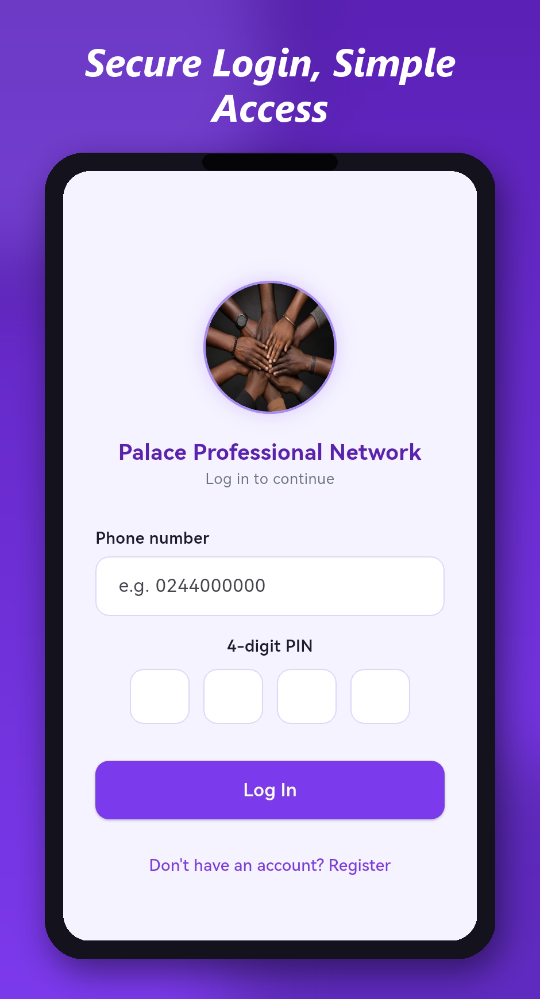
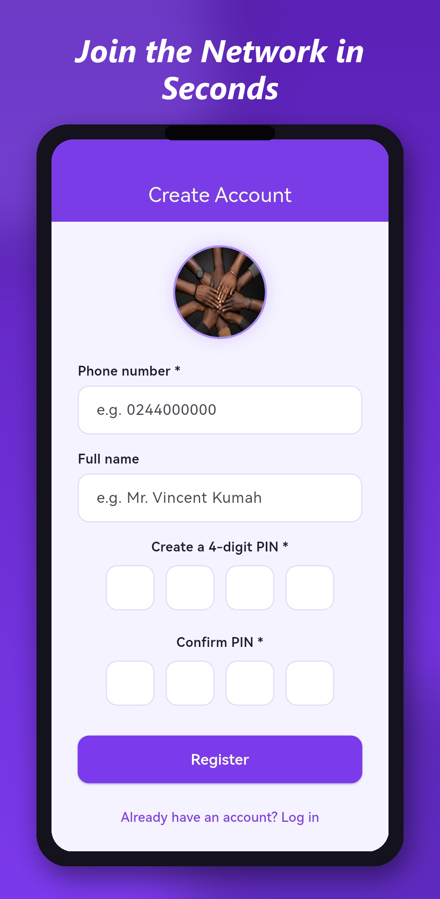
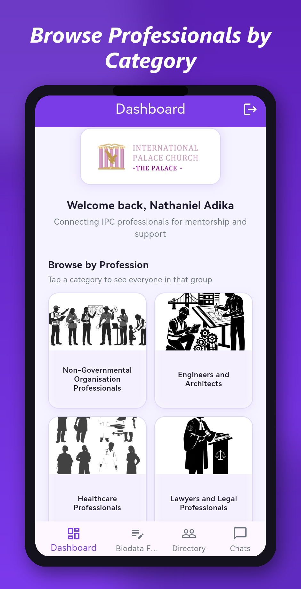
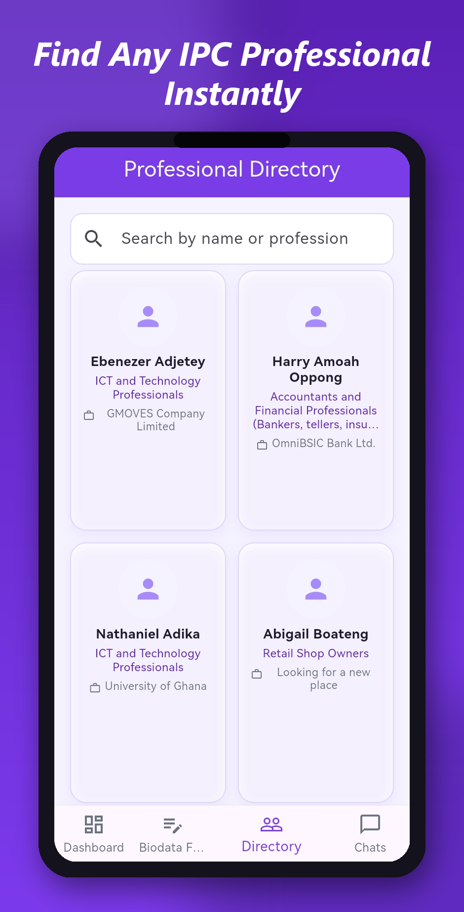
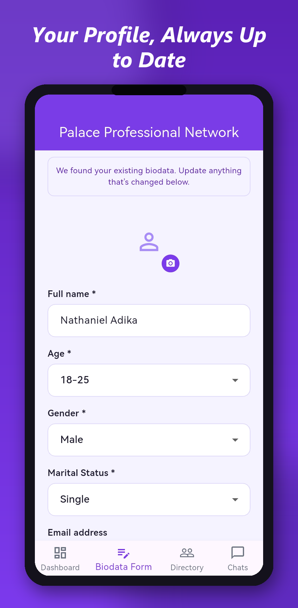
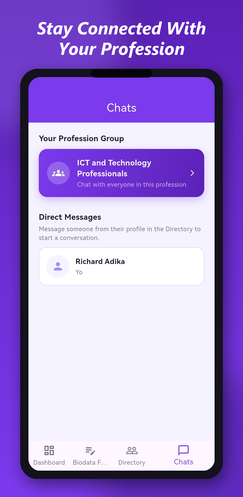
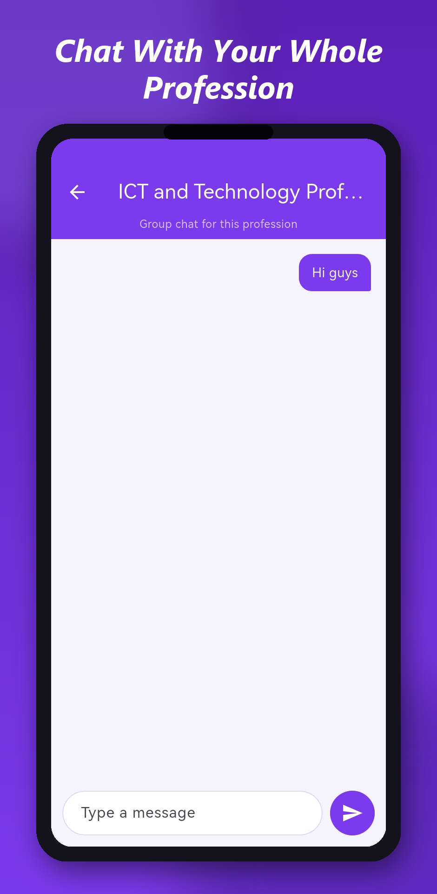

<p align="center">
  
</p>

<h1 align="center">Palace Professional Network</h1>

<p align="center">
  <b>Connecting International Palace Church (IPC) professionals for mentorship, collaboration and support.</b>
</p>

<p align="center">
  
  
  
  
  
  
</p>

---

## About

**Palace Professional Network** is a mobile app for members of the International Palace Church. Members register their professional biodata, find other IPC professionals by name or profession, and message them one-to-one or in a group chat for everyone in their profession.

The goal is simple: make it easy for church members to find mentors, share opportunities and support one another in their careers.

## Screenshots

<table>
  <tr>
    <td align="center"><br /><sub><b>Sign in with phone &amp; PIN</b></sub></td>
    <td align="center"><br /><sub><b>Create an account</b></sub></td>
    <td align="center"><br /><sub><b>Browse professionals by category</b></sub></td>
  </tr>
  <tr>
    <td align="center"><br /><sub><b>Find any IPC professional instantly</b></sub></td>
    <td align="center"><br /><sub><b>Share your professional biodata</b></sub></td>
    <td align="center"><br /><sub><b>Your conversations</b></sub></td>
  </tr>
  <tr>
    <td align="center"><br /><sub><b>Chat with your whole profession</b></sub></td>
    <td></td>
    <td></td>
  </tr>
</table>

## Features

### 👤 Accounts & profiles
- Register and sign in with a **phone number and 4-digit PIN**; change your PIN in Settings.
- **Biodata form**: name, age range, gender, marital status, email, profession category and sub-category, place of work and profile photo.
- New members are guided straight to the biodata form, because the directory only lists members who have completed it.

### 🔎 Professional directory
- Browse members by **profession category** from the dashboard: NGO, engineering, healthcare, legal, ICT, finance, education, hospitality and more.
- **Search** by name or profession, then open a member's profile and message them.

### 💬 WhatsApp-style chat
| | |
|---|---|
| **Direct messages** | One-to-one chats with any member |
| **Profession groups** | Automatic group chat for everyone in your profession category |
| **Unread badges** | Red counters on the Chats tab and on each conversation |
| **Emoji** | Emoji keyboard in the message box |
| **Reply** | Swipe a message to quote it |
| **Reactions** | Long-press to react 👍 ❤️ 😂 😮 😢 🙏 (or any emoji) |
| **Edit / delete** | Edit within 15 minutes; delete for everyone |
| **Polls** | Single or multiple choice, live results, see who voted |
| **Photos & documents** | Camera or gallery (with captions), PDFs, Word, Excel… up to 15 MB |
| **Voice notes** | Tap to record, stop to preview, send |
| **Stickers & GIFs** | Search powered by GIPHY |
| **Presence** | "typing…", online / last seen, ✓✓ read receipts in DMs |
| **Push notifications** | Heads-up notifications when the app is closed, plus an in-app banner when it's open |

## Architecture

```text
┌──────────────────────┐        HTTPS + Socket.IO        ┌─────────────────────────────┐
│  Flutter Android app │ ─────────────────────────────▶  │  Gateway (NestJS)           │
│  (frontend/)         │ ◀─────────────────────────────  │  REST API · WebSocket · JWT │
└──────────────────────┘                                 └──────────────┬──────────────┘
          ▲                                                             │ TCP (internal)
          │ push (FCM)                                                  ▼
┌─────────┴────────────┐                                 ┌─────────────────────────────┐
│  Firebase Cloud      │ ◀────────────────────────────── │  Biodata service (NestJS)   │
│  Messaging           │                                 │  auth · biodata · chat      │
└──────────────────────┘                                 └──────────────┬──────────────┘
                                                                        │
            Cloudinary (photos, files, voice notes)  ◀── gateway        ▼
            GIPHY (sticker / GIF search)             ◀── gateway   MongoDB Atlas
```

Both NestJS apps run in **one Docker container** on Render ([backend/start.sh](backend/start.sh)), talking to each other over `127.0.0.1`.

### Tech stack

| Layer | Technology |
|---|---|
| Mobile app | Flutter (Dart), `socket_io_client`, `firebase_messaging`, `record`, `audioplayers`, `emoji_picker_flutter` |
| API gateway | NestJS 11, Express, Socket.IO, JWT auth, Multer |
| Core service | NestJS microservice (TCP), Mongoose |
| Database | MongoDB Atlas |
| Media storage | Cloudinary |
| Push notifications | Firebase Cloud Messaging |
| Hosting | Render (Docker), defined in [render.yaml](render.yaml) |

## Project structure

```text
Palace_Professional_Network/
├── backend/                     # NestJS monorepo
│   ├── apps/
│   │   ├── gateway/             # Public REST + WebSocket API (port 3000)
│   │   └── biodata-service/     # Auth, biodata & chat logic over TCP (port 3001)
│   ├── libs/shared/             # DTOs, constants, TCP message patterns
│   ├── scripts/                 # One-off maintenance scripts
│   ├── Dockerfile
│   └── start.sh                 # Runs both services in one container
├── frontend/                    # Flutter mobile app
│   └── lib/
│       ├── pages/               # Screens (login, dashboard, directory, chat…)
│       ├── services/            # API, chat socket, uploads, push, unread counts
│       ├── widgets/chat/        # Message bubbles, composer, polls, voice player…
│       └── config/api_config.dart
├── web/                         # React + Vite web client
├── store-assets/                # Play Store graphics & screenshots
├── render.yaml                  # Render deployment blueprint
├── privacy.md                   # Privacy policy
├── delete-account.md            # Account deletion instructions
└── delete-data.md               # Data deletion instructions
```

## Getting started

### Prerequisites
- **Node.js 20+** and npm
- **Flutter** (stable channel) with the Android SDK
- A **MongoDB Atlas** cluster (or any MongoDB connection string)

### 1. Backend

```bash
cd backend
npm install
cp .env.example .env      # then fill in the values below
npm run dev               # starts biodata-service + gateway with hot reload
```

The API is then available at `http://localhost:3000`.

### 2. Mobile app

```bash
cd frontend
flutter pub get

# Against the deployed backend (default)
flutter run

# Against your local backend
flutter run --dart-define=API_BASE_URL=http://10.0.2.2:3000   # Android emulator
flutter run --dart-define=API_BASE_URL=http://localhost:3000  # desktop / web
```

## Environment variables

| Variable | Required | Description |
|---|---|---|
| `MONGODB_URI` | ✅ | MongoDB connection string |
| `JWT_SECRET` | ✅ | Long random string used to sign login tokens |
| `PORT` | | Gateway port (default `3000`; Render sets this automatically) |
| `BIODATA_SERVICE_HOST` / `BIODATA_SERVICE_PORT` | | Internal service address (default `127.0.0.1:3001`) |
| `CLOUDINARY_CLOUD_NAME` | for media | Cloudinary cloud name |
| `CLOUDINARY_API_KEY` + `CLOUDINARY_API_SECRET` | for media | Signed uploads, **or**… |
| `CLOUDINARY_UPLOAD_PRESET` | for media | …an *Unsigned* upload preset instead of the key/secret |
| `GIPHY_API_KEY` | for stickers | GIPHY API key for sticker & GIF search |
| `FIREBASE_SERVICE_ACCOUNT` | for push | Firebase service-account JSON (raw or base64) |

Optional features switch off cleanly when their variables are missing: the app shows *"not set up yet"* instead of failing.

> 🔒 Never commit `.env`, `key.properties`, `*.jks` or Firebase **service-account** keys. They are already listed in `.gitignore`.

## API overview

All endpoints except register, login and form options require `Authorization: Bearer <token>`.

| Method | Endpoint | Description |
|---|---|---|
| `POST` | `/auth/register` | Create an account (phone + PIN) |
| `POST` | `/auth/login` | Sign in, returns a JWT |
| `POST` | `/auth/change-pin` | Change PIN |
| `GET` | `/biodata/options` | Form options (categories, age ranges…) |
| `POST` | `/biodata` | Create / update my biodata (multipart, optional `image`) |
| `GET` | `/biodata/me` | My biodata (`null` if not submitted yet) |
| `GET` | `/biodata` | Everyone's biodata (directory) |
| `GET` | `/chat/dm-rooms` | My direct-message conversations |
| `GET` | `/chat/unread` | Unread counts per chat |
| `GET` | `/chat/presence/:phone` | Last seen + profile photo |
| `POST` | `/chat/upload` | Upload a chat attachment (max 15 MB) |
| `GET` | `/chat/stickers?q=&kind=` | Search stickers / GIFs |
| `POST` / `DELETE` | `/chat/device-token` | Register / remove a push-notification device |

**Real-time (Socket.IO):** the client connects with the JWT in `auth.token` and emits `join`, `message`, `react`, `edit`, `delete`, `vote`, `typing` and `read`. The server emits `history`, `message`, `messageUpdated`, `typing`, `read` and `chatError`.

## Deployment

### Backend on Render
1. In the Render dashboard choose **New → Blueprint** and connect this repository. Render reads [render.yaml](render.yaml).
2. Enter the secret environment variables when prompted (see the table above).
3. In MongoDB Atlas → **Network Access**, allow `0.0.0.0/0` (Render has no fixed outbound IP on the free plan).
4. Every push to `main` redeploys automatically.

> ℹ️ On Render's free plan the service sleeps after 15 minutes idle; the first request afterwards takes about a minute.

### Android release
1. Bump `version:` in [frontend/pubspec.yaml](frontend/pubspec.yaml). The number after `+` must go up for every Play Store upload.
2. Make sure `frontend/android/key.properties` and the upload keystore are present.
3. For push notifications, place `google-services.json` in `frontend/android/app/`.
4. Build:
   ```bash
   cd frontend
   flutter build appbundle --release   # → build/app/outputs/bundle/release/app-release.aab
   ```
5. Upload the `.aab` in Google Play Console under the track you want (Internal, Closed or Production).

## Privacy

- [Privacy Policy](privacy.md)
- [Delete your account](delete-account.md)
- [Delete specific data](delete-data.md)

## Author

Built by **Nathaniel Adika** for the **International Palace Church (IPC)**.
